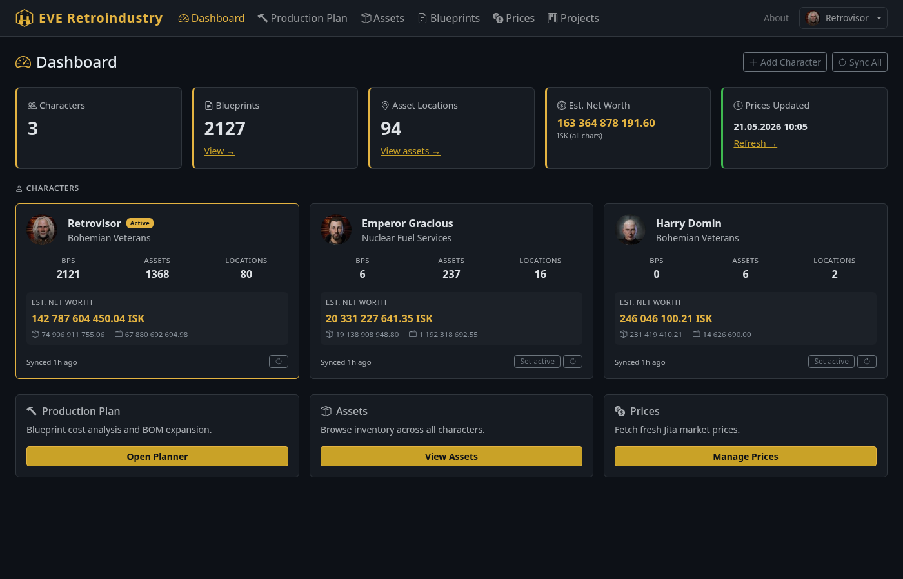
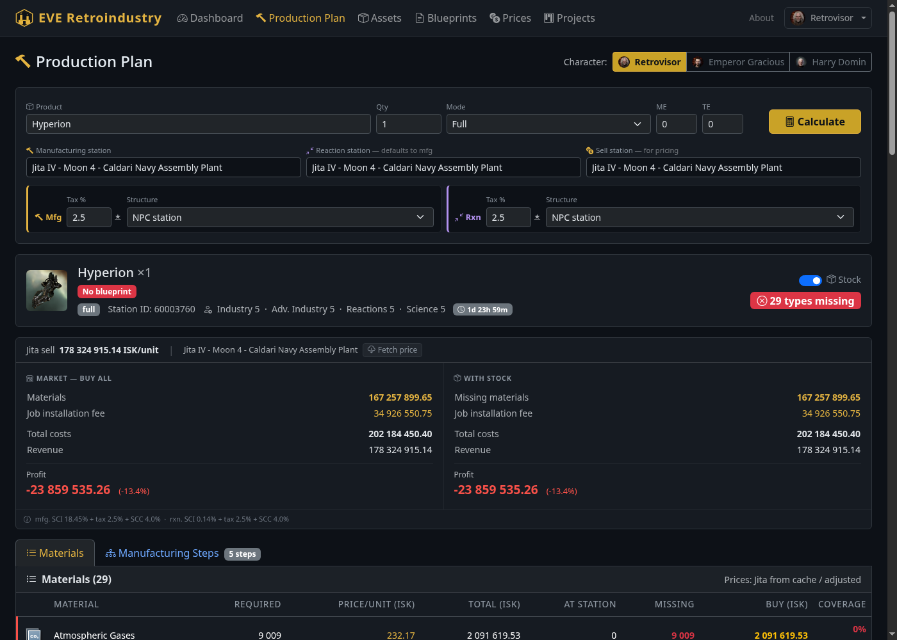
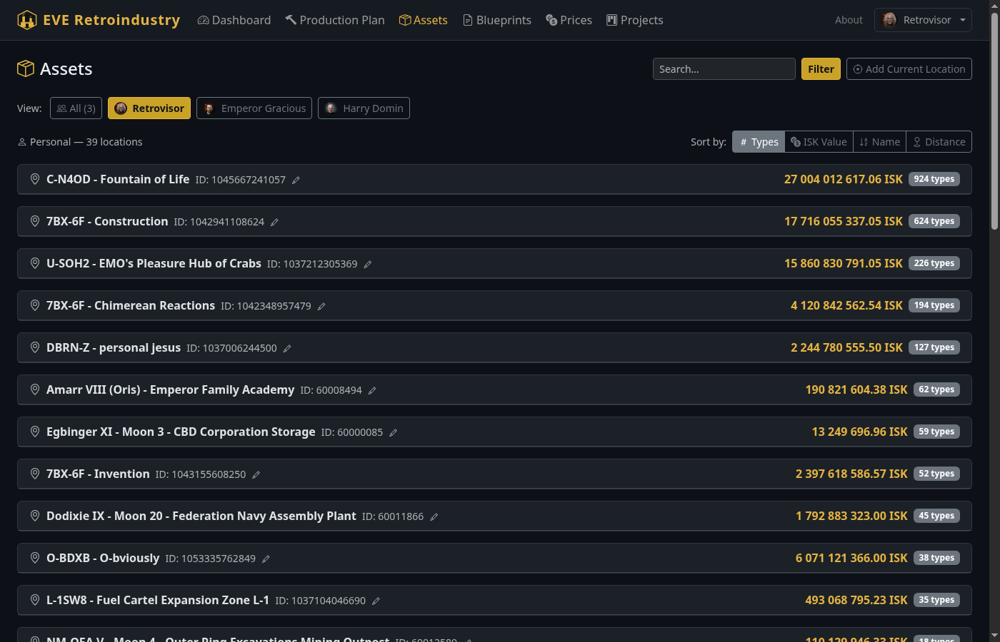

# EVE Retroindustry

A local industry calculator for EVE Online. Runs as a web app on your machine — blueprint cost analysis, bill of materials expansion, Jita market pricing, asset tracking, and production project management. Multi-character support: load all your alts and switch between them per page.



---

## Features

- **Multi-character Dashboard** — log in any number of alts via EVE SSO; see all characters at a glance with portrait, corporation, blueprint count, asset count, and estimated net worth (assets + wallet ISK)
- **Production Planner** — enter any ship or component, pick a station, get a full bill of materials with Jita buy/sell prices, your asset coverage, manufacturing job time and fees (EIV × SCI × facility tax × SCC), profit vs. market and vs. stock, and the cheapest make-vs-buy decomposition
- **Blueprint Library** — full character (and alt) blueprint list with ME/TE levels, BPO vs BPC, runs remaining, organised by station and container
- **Asset Tracking** — character + corporation inventory grouped by location and container (incl. all corp hangar divisions), with estimated ISK value per stack and per station



- **Jita Price Cache** — fetches live market data from ESI, caches locally, refresh on demand; custom price overrides for items missing from Jita
- **Structure & Rig Modelling** — supports Raitaru / Azbel / Sotiyo / Athanor / Tatara with per-slot rig selection; ME/TE bonuses applied correctly with security multiplier (highsec 1.0× / lowsec 1.9× / null 2.1×)
- **Production Projects** — save a plan as a project, track which jobs are done, and get a unified shopping list across multi-stage manufacturing
- **In-app updates** — check for new releases and apply them without leaving the app
- **System tray** — runs in the system tray; right-click for **Open App** and **Quit**



---

## Installation (Windows / Linux)

1. Download the latest release from [**Releases**](https://github.com/ScoopEMPRetro/Eve-retroindustry/releases/latest)
2. Extract the ZIP anywhere
3. Run `EVE_Retroindustry.exe` (Windows) or `EVE_Retroindustry` (Linux)
4. On first launch the app downloads ~5 MB of game data automatically
5. Open the system tray icon → **Open App**, then click **Log In** in the top right and authenticate with your EVE character. Add more alts by clicking **+ Add Character** in the character dropdown.

No Python, no dependencies, no installation wizard.

> **Note:** Windows may show a SmartScreen warning on first launch because the executable is unsigned. Click *More info → Run anyway*.

---

## Development Setup

Requires Python 3.11+.

```bash
git clone https://github.com/ScoopEMPRetro/Eve-retroindustry.git
cd Eve-retroindustry
python -m venv .venv && source .venv/bin/activate   # Windows: .venv\Scripts\activate
pip install -r requirements.txt
```

Import the Static Data Export (SDE) into the local database:

```bash
python import_sde.py
```

Run the dev server:

```bash
uvicorn app.web.main:app --reload --port 8000
```

Open [http://localhost:8000](http://localhost:8000).

---

## Building a Release

Releases are built automatically by GitHub Actions when a version tag is pushed:

```bash
git tag v0.x.y && git push origin v0.x.y
```

The workflow builds Windows and Linux binaries and creates a GitHub Release with:

- `EVE_Retroindustry-vX.Y.Z-win64.zip`
- `EVE_Retroindustry-vX.Y.Z-linux.zip`
- `sde_base.db` (game data, downloaded by the app on first run)

To build locally:

```bash
python scripts/build_sde_base.py
pyinstaller eve_retroindustry.spec --noconfirm
```

---

## Tech Stack

| Layer | Library |
|---|---|
| Web framework | FastAPI + Uvicorn |
| Templates | Jinja2 + Bootstrap 5 (dark) |
| Database | SQLite via sqlite3 |
| EVE API | ESI (esi.evetech.net) |
| HTTP client | httpx (async) |
| Tray icon | pystray + Pillow |
| Packaging | PyInstaller (onedir) |

---

## Data & Privacy

All data is stored locally on your machine in:

| File | Contents |
|---|---|
| `eve_cache.db` | Blueprints, assets, prices, projects, OAuth tokens for all characters |
| `.eve_config.json` | EVE SSO client ID only |
| `eve_retroindustry.log` | Application log (frozen builds only) |

Nothing is sent to any third-party server other than the official EVE Online ESI API (`esi.evetech.net`) and the EVE SSO login server (`login.eveonline.com`).

---

## Legal

EVE Online and the EVE logo are the registered trademarks of CCP hf. All rights are reserved worldwide. This application is not endorsed by or affiliated with CCP hf.

Market data and character information are fetched from the [EVE Swagger Interface (ESI)](https://esi.evetech.net) under CCP's developer license.

---

## License

MIT — see [LICENSE](LICENSE)
